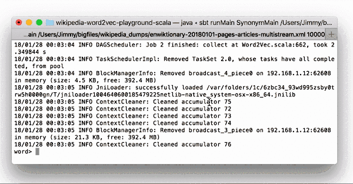
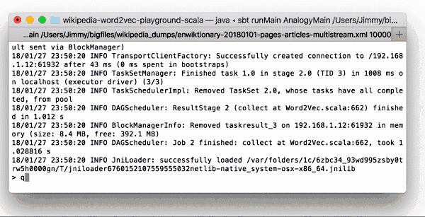

## wikipedia-word2vec-playground
[](https://travis-ci.org/nwtgck/wikipedia-word2vec-playground-spark)

A playground of word2vec from [Wikipedia Dump](https://dumps.wikimedia.org/) with [Spark](https://spark.apache.org/)

## Synonym



## Analogy



## Run Analogy in Cluster Mode in localhost

Here is an example to run Analogy in Cluster Mode in localhost

```bash
# Go to this repo
cd <this repo>
# Download & Extract spark commands (source: https://spark.apache.org/downloads.html)
curl https://archive.apache.org/dist/spark/spark-2.0.0/spark-2.0.0-bin-hadoop2.7.tgz | tar zxf -
# Run a master
./spark-2.0.0-bin-hadoop2.7/sbin/start-master.sh -h localhost -p 7077
# Run a slave
./spark-2.0.0-bin-hadoop2.7/sbin/start-slave.sh spark://localhost:7077
# Generate jar
sbt assembly
# Run Analogy
./spark-2.0.0-bin-hadoop2.7/bin/spark-submit --class "io.github.nwtgck.wikipedia_word2vec_playground.Main" --master spark://localhost:7077 target/scala-2.11/wikipedia-word2vec-playground-assembly-0.1.jar --mode=analogy --wikipedia-dump=$HOME/bigfiles/wikipedia_dumps/enwiktionary-20180101-pages-articles.xml --page-limit=1000
```

## Options Help

```txt
Usage: Wikipedia Word2Vec Playground [options]

  --mode <value>           play mode (e.g. 'synonym', 'analogy', 'train-only')
  --wikipedia-dump <value>
                           path of Wikipedia dump XML
  --page-limit <value>     limit of page to use
  --word2vec-iterations <value>
                           the number of iterations of word2vec
```

## References

* <https://dumps.wikimedia.org/enwiktionary/20180101/>